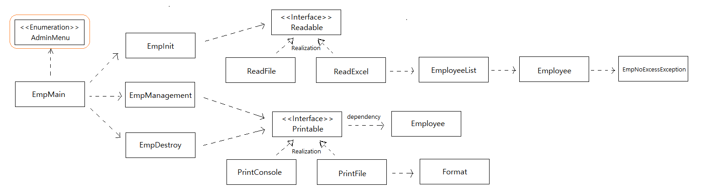

직원관리 프로그램
=====
* 모 회사 면접 문제
* 개발환경: Java 8, Gradle
- - -
## 목차
1. [Todo](#Todo)
2. [구현](#구현)
	* [Screenshots](#Screenshots)
	* [UML](#UML)
3. [참고](#참고)
	* [코드설명](docs/review_v1.md)

## Todo

- [x] 직원 정보 입력
	- [ ] 직원 번호는 유일한 값을 가짐(000 ~ 999)
	- [ ] 전화번호와 이메일 주소는 패턴에 맞는 값만 입력받을 수 있으며, 정규표현식 사용 가능
	- [ ] 파일 저장 형식 제한 없음
- [x] 직원 목록 출력
	- [x] 프로그램 실행 시 파일을 읽어 기존 정보 초기화
- [x] 직원 상세 정보 출력
- [x] 직원 정보 수정
- [x] 직원 정보 삭제

- - -
 

##### [목차로 이동](#목차)

## 구현

### Screenshots

##### [목차로 이동](#목차)

### UML
 

##### [목차로 이동](#목차)

## 특이사항
* [참고 코드](https://github.com/jeon7/employee_management)
- - -
* [Why can't we can't have static outer classes](https://stackoverflow.com/questions/18036458/why-cant-we-have-static-outer-classes)
* [스트림 소개 및 병렬처리](https://sas-study.tistory.com/237)

##### [목차로 이동](#목차)
