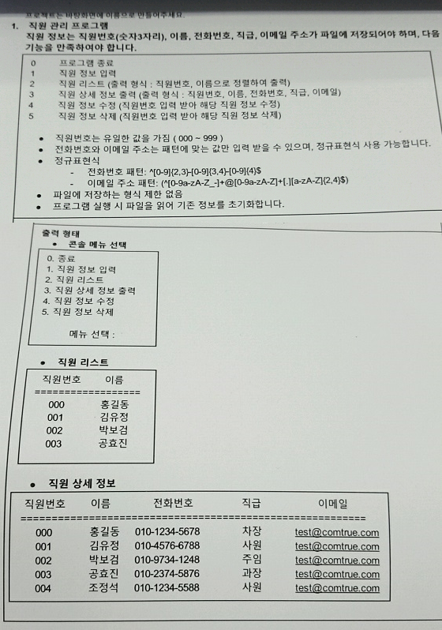

직원관리 프로그램
=====
모 회사 면접 문제로 나왔던 문제인데 언어를 공부하기 좋은 예제인 것 같아 기록한다.
- - -
## 목차
1. [요구사항](#요구사항)
2. [구현](#구현)
3. [설계](#설계)

## 요구사항
 

##### [목차로 이동](#목차)

## 구현
* .
* .

##### [목차로 이동](#목차)

## 설계

##### [목차로 이동](#목차)